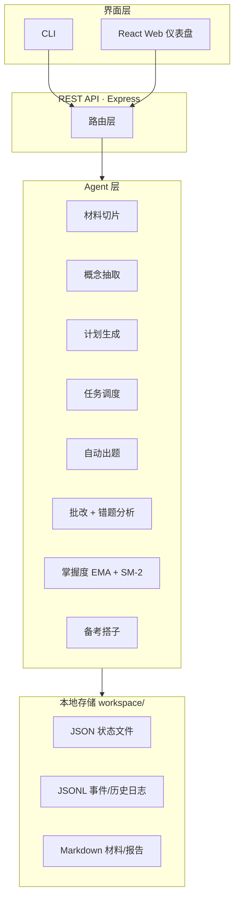

<p align="center">
  
</p>

<h1 align="center">StudyMate Agent</h1>

<p align="center">一个"教材进、成绩出"的本地优先个人备考 Agent：上传你的教材，AI 帮你出题、批改、追错题、排复习计划。</p>

StudyMate Agent 是面向考证党、考研党、在职学习者的 **AI 备考闭环**。它不是又一个题库 App——它围绕**你自己的资料**构建知识图，跑通「学习 → 测验 → 批改 → 错题回流 → 动态复习」的完整闭环，并有一个会陪你说话的拟人化搭子。

```
# 教材
学习材料 (你的 PDF/Markdown)
   ↓ 概念抽取
知识图谱 (概念 + 前置依赖 + 掌握度)
   ↓ 计划生成
三阶段复习计划 (学习/巩固/冲刺 + SM-2 间隔重复)
   ↓ 每日任务
今日任务 (含自动顺延/未完成迁移)
   ↓ 自动出题
测验 (基于今日知识点 + 到期薄弱点)
   ↓ 即时批改
批改结果 (错误分类 + 薄弱点定位)
   ↓ 错题回流
掌握度更新 → 计划调整 → 回到计划生成
```

## 产品亮点

- **自有资料驱动**：导入 PDF/Markdown，语义切片、抽取概念与前置依赖，构建你的知识图
- **真正的复习闭环**：错题累积画像、掌握度 EMA 更新、SM-2 间隔重复、计划自动调整——学了不忘
- **拟人化备考搭子**：4 个角色（芽团/晴川/凛川/柚宁），跨会话记忆、连续打卡、关键时刻介入，活跃度随连续学习自动升级
- **本地优先 + 离线可用**：所有数据存本地 `workspace/`，无 API key 时用 Mock LLM 跑通全流程

---

## 快速开始（Demo，无需 API Key）

一条命令生成示例数据（CPA 会计基础案例），再启动即可体验完整闭环：

```bash
npm install
npm run demo     # 生成示例数据到 workspace/（原有数据自动备份到 workspace_pre_demo.bak）
npm run serve    # 启动后端 3456（含 Web 前端）
```

打开 http://localhost:3456 —— 首页 →「学习」/studio 走「材料 → 回忆 → 测验 → 反馈 → 复盘」，再到「成长」页看 Session 趋势。

> 配置 `OPENAI_API_KEY` 后使用真实大模型；未配置则走 Mock LLM，演示完整可用。

## 两种界面

| 界面 | 说明 | 启动 |
|---|---|---|
| **Web 仪表盘** | React 单页应用：首页 Lobby、/studio 学习闭环、测验/批改、成长趋势、搭子、设置 | `npm run serve`（生产，3456）或 `npm run web`（开发，5173） |
| **CLI** | Commander 命令行：建档、调研、导入、计划、任务、测验、批改、搭子聊天 | `npm run build && node dist/cli.js --help` |

### CLI 快速上手

```bash
studymate init
studymate exam create --name "2026年初级会计资格考试" --date 2026-09-15 --subjects "经济学基础,会计学" --daily 60
studymate ingest ./materials/micro-economics.md
studymate plan --exam 2026-09-15 --daily 60
studymate today          # 今日任务
studymate quiz           # 生成今日测验
studymate grade --answers answers.json   # 批改并自适应调整
studymate metrics        # 学习指标
studymate character list # 查看可选搭子
studymate chat           # 和搭子多轮对话
```

---

## 测试与覆盖率

```bash
npm test                 # Vitest 全量测试（297+ 用例）
npx vitest run --coverage  # 覆盖率报告（输出到 coverage/）
```

**后端代码覆盖率**（仅统计 `src/`，前端以构建验证为主）：

| 模块 | 覆盖率 |
|---|---|
| 核心逻辑 agents（出题/批改/掌握度/计划/搭子） | ~93% |
| 领域模型 domain | 96% |
| 核心工具 core | ~92% |
| 整体（含 server 路由层） | ~79% |

## 架构



- **CLI**（`src/cli.ts`）：Commander 命令，委托给 Agent 层
- **REST API**（`src/server/`）：Express 5，`/api/*` + 静态托管 Web 构建
- **Web UI**（`web/`）：React 18 + Vite 5，含 /studio 学习闭环、Ambient 主题、浮动桌宠
- **Agents**（`src/agents/`）：学习循环各步骤的模块化 Agent
- **Core**（`src/core/`）：LLM 客户端、事件日志（schema v2）、工作区管理、角色 schema
- **Workflows**（`src/application/workflows/`）：跨 Agent 编排（批改自适应、/studio 学习会话、Session 历史）

所有状态本地存储在 `workspace/`。

## 功能清单

- **考试项目建档**：从考试名称、日期、科目开始生成完整备考项目
- **备考调研**：搜索官方/经验/资料来源，保留引用，用户确认后入库
- **任意资料导入**：PDF 与 Markdown，按标题层级语义切片，稳定 ID 防覆盖
- **概念抽取**：LLM 提取核心概念与前置依赖，三色 DFS 检测循环，生成学习顺序
- **动态复习计划**：学习/巩固/冲刺三阶段，SM-2 间隔重复
- **每日任务推送**：Markdown 今日任务，未完成自动顺延（幂等）
- **自动出题**：基于当日知识点与到期薄弱点生成单选/多选题，附解析与回链
- **即时批改**：客观题自动判分，错误分类与薄弱点定位
- **错题回流**：累积式错题画像、掌握度历史、自动插入复习任务
- **学习闭环 /studio**：材料 → 主动回忆 → 测验 → 反馈 → 复盘，Session 持久化、刷新可恢复
- **拟人化备考搭子**：4 角色、跨会话记忆、关键时刻介入、活跃度分级
- **成长数据 /growth**：Session 历史 + 正确率/时长趋势（recharts）
- **Ambient 主题**：4 角色 × 深浅双主题的整页空间氛围
- **CLI + Web 双界面**、**全链路事件审计**（`workspace/event_log/events.jsonl`）、**本地优先 + 离线可用**

> 🎬 **Demo 视频**：[B 站在线观看](https://www.bilibili.com/video/BV1gduB6QEMD/)（「你的备考搭子」，78 秒，晓伊女声中文旁白）｜[本地文件](screenshots/demo_v2/studymate_demo.mp4)。界面截图见 [`screenshots/`](screenshots/)。

## 当前限制

- **单用户 / 单考试项目**：workspace 同时支持一个活跃考试项目
- **纯文本交互**：无语音 / 动画（角色用精灵图静态帧 + CSS 微动）
- **Mock 降级**：无 API key 用 Mock LLM/Mock 搜索，返回固定演示内容
- **前端暂无单测**：以 `tsc -b && vite build` + 手动验收为主，后端有完整 vitest 套件

## 开发

```bash
npm install
npm run build      # 编译 TS 到 dist/
npm run dev        # watch 模式
npm run test       # Vitest 套件
npm run demo       # 生成示例数据（备份原 workspace）
npm run serve      # 构建 + 启动后端 3456（含 Web）
npm run web        # 前端开发服务器 5173（Vite proxy /api → 3456）
```

## 环境变量

| 变量 | 用途 | 默认 |
|---|---|---|
| `OPENAI_API_KEY` | 真实 LLM 调用 | —（无则 Mock） |
| `OPENAI_BASE_URL` | OpenAI 兼容 API 地址 | `https://api.openai.com/v1` |
| `LLM_MODEL` | 模型名 | `gpt-4o-mini` |
| `SERP_API_KEY` | 备考调研搜索 | —（无则 Mock） |

无 API key 时从 `.env.local` 加载（见 `.env.example`）。

## 文档

- [`screenshots/`](screenshots/) — 界面截图（9 页 × 深浅主题）+ 项目工程体检
- [`screenshots/demo_v2/`](screenshots/demo_v2/) — Demo 视频成片 + 配音文案 + 复现脚本
- [`docs/PRODUCT_INTRO.md`](docs/PRODUCT_INTRO.md) — 产品介绍（当前阶段）
- [`docs/PRD_v1.0.md`](docs/PRD_v1.0.md) — 原始 PRD
- [`docs/plans/`](docs/plans/) — 分阶段实施计划（P0a/P0b/P1/P2 已完成）
- [`docs/character-asset-spec.md`](docs/character-asset-spec.md) — 角色状态资产规范
- [`docs/windows-desktop-companion-evaluation.md`](docs/windows-desktop-companion-evaluation.md) — Windows 常驻桌宠评估
- [`PRIVACY.md`](PRIVACY.md) — 隐私声明（数据本地优先）
- [`AGENTS.md`](AGENTS.md) — AI 贡献者指南

## License

本仓库暂未附加开源许可证，保留所有权利（All Rights Reserved）。如需在特定协议下使用、修改或分发，请联系作者洽谈。
